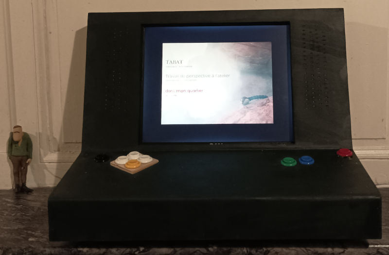

# PyKiosk

A kiosk made with PyGame.

## License

This program is free software: you can redistribute it and/or modify
it under the terms of the GNU General Public License as published by
the Free Software Foundation, either version 3 of the License, or
(at your option) any later version.

This program is distributed in the hope that it will be useful,
but WITHOUT ANY WARRANTY; without even the implied warranty of
MERCHANTABILITY or FITNESS FOR A PARTICULAR PURPOSE.  See the
GNU General Public License for more details.

See [License](LICENSE) for further details.

This program includes code from [Jokymon's GifImage_ext](https://github.com/Jokymon/GIFImage_ext), which is released in Public Domain.

## What it does

This program is a kiosk. In the background, there is an animated GIF of your design, in front of it, text and subtitle will compose your menu, with the font of your choice.

The user selects menu elements by pressing up and down. Enter launches either a video or an application depending on how you configured the menu. When the video or game quits, 
the menu comes back, preventing a person from leaving the application.

This goes best with a limited setup where the person can only press specific keys on the keyboard (keypad and enter), and where the desktop is empty and menu bar hidden.

"Q" quits the kiosk.

In windows, Alt-Tab and others work and enable the person to leave, so be careful.

## Installation

### With Windows (Only tested on Windows 10 and Windows 7)

Edit [install.bat](install.bat) to your convenience. You can either use the binaries included in the install/ directory, or download your own.
The binaries come from Python's website, Videolan.org's website, and the "wheels" for pygame and pillow come from [here](https://www.lfd.uci.edu/~gohlke/pythonlibs/).

Run install.bat. This installer will install python, vlc, pygame, and pillow, and it will create a shortcut to launch.bat in your Startup menu.

When you will reconnect to the current account, the kiosk starts.

If you need to move the directory containing the kiosk after installation, run "changedirectory.bat" after moving the directory, that will update the link in the startup menu.

#### Manual installation

You will need:

- Python version 3.8+
- PyGame and PILlow up, but not higher than, version 8.4.0 (will NOT work with 9.x.x)
- VLC version 3.x

Download them and install.

Try running "python3 kiosk.py" until it works.

### With Linux

You can use install.sh to automate the install of prerequisites (pygame, pip) on Debian. Otherwise, you're on your own.

## Run

Windows: use launch.bat or just restart the user session, the kiosk will auto start.

Linux : python kiosk.py. It's your job to make it start automatically somehow.

## Configure

Put a single-frame or animated gif in the img/ directory and name it fond_root.gif .

The kiosk will display the animation by stretching it to get a full screen at the biggest possible resolution.

Edit conf/conf.json by inspiring yourself with the [sample](conf/conf.json.sample):

        {
            "apps":{
                "gamedirectory1":{
                    "app":"game.exe",
                    "main":["sample.ttf", "Run",32, 23, 323, "cccccc","ffffff"],
                    "sub":["sample.ttf", "Some app!",12, 27, 369, "cccccc","ffffff"],
                    "order": 2
                },
                ...
            },
            "videos":{
                "videodirectory1":{
                    "main":["sample.ttf", "Show", 30, 23, 225, "cccccc","ffffff"],
                    "sub":["sample.ttf", "Some video!", 13 , 25, 263, "cccccc","ffffff"],
                    "order": 1
                },
                ...
            }
        }

Each menu element is defined by a title ("main") _and_ a subtitle ("sub"). The first parameter indicates the font used, the second parameter the UTF-8 string to display,
the 3rd parameter the font size in pixels, _relative to the background image's size_ (a 10px font with a 512px gif will be displayed at a 20px width if the gif is stretched
fullscreen at a resolution of 1024px), parameter 4 and 5 are the localization of the top left corner of the text element, and parameter 6-7 are the normal and highlight
color of the font, expressed in hexadecimal RGB (00 to ff).

Put the font(s) in the font directory, the filename must match the one indicated in conf.json. OTF and TTF work.

Put your videos in directories that are named like the configuration elements, subdirectories of media: here above, videodirectory1, ...

Put your apps the same way: media/gamedirectory1, ... (or you can also give an absolute path instead such as c:\...somedir\ or /home/user/somedir...)

"order" describes the order in which the elements are selected when the user presses up or down keys. Topmost element should be 1, etc.

## TODO

- Possibility of not using subtitles
- Porting animated gif library code to Pillow 9.x.x
- Windows uninstaller
- Proper comments in file
- Prevent flickering when launching video via VLC.
